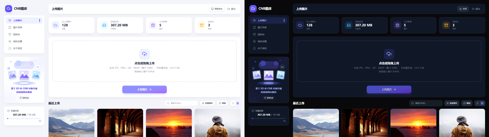

# CNB 图床

**CNB 图床**
是一个轻量级、无服务器的图片托管服务，支持图片上传（批量多选）、自动压缩与缩略图生成
该项目基于 **腾讯云 EdgeOne Pages Functions** 与 **CNB 对象存储服务**
构建，实现零成本部署与全球 CDN 加速

## 页面预览



------------------------------------------------------------------------

## 🚀 功能特性

-   📤 支持拖拽或点击上传图片，批量多选，Ctrl+V 粘贴直接上传（截图自动命名为 `screenshot-时间戳`）
-   📁 支持整个文件夹拖拽上传，自动递归收集图片
-   🗜️ 自动压缩图片为 WebP 以节省空间，可调压缩质量与长边尺寸上限
-   🎞️ GIF 动图智能跳过压缩，完整保留动画
-   🖼️ 自动生成缩略图（可关闭）
-   🈶 完整支持中文文件名，文件命名规则可选：保留原名 / 时间戳 / 随机 ID
-   🔗 一键获取图片直链（通过 EdgeOne 代理），支持直链 / Markdown / HTML / BBCode 单张与批量复制
-   📱 结果卡自带二维码，手机扫码即可获取链接
-   📋 图片列表管理（响应式布局，桌面与移动端均无横向滚动）：
    -   搜索、按文件名/大小/时间排序、按图片类型筛选
    -   多选批量复制与删除（删除带二次确认弹窗）
    -   回收站软删除：误删 30 天内可随时恢复，过期自动清理
    -   统计面板：总数量 / 总大小 / 图片类型分布
    -   导出图片记录为 JSON 备份
    -   键盘快捷键：↑↓ 选择、Enter 查看、F2 复制直链、Delete 删除、? 查看帮助
    -   每页条数可调（10/20/50/100）
-   ⚙️ 设置页：压缩质量 / 尺寸上限 / 保持原图 / 缩略图开关 / 上传后自动复制 / 默认复制格式 / 文件命名规则 / 每页条数
-   🌗 日间 / 夜间 / 跟随系统三档主题切换，界面自适应移动端
-   ⏰ 登录支持"记住我 7 天"（长效令牌，公用电脑请勿勾选）
-   📷 兼容 PicGo 客户端上传（配置 PicGo API 上传）
-   ⚡ 前端使用 Vue 3 + Vite 高效构建
-   🔒 可选设置访问密码保护上传界面

------------------------------------------------------------------------

## 🧰 技术栈

- **前端**: Vue 3 + TypeScript + Vite + TailwindCSS
- **后端**: EdgeOne Pages Node Functions + Express.js
- **上传**: Multer + CNB 对象存储服务

------------------------------------------------------------------------

## 📦 快速开始

### 📥 安装依赖

``` bash
pnpm install
```

### 🧑‍💻 本地开发

``` bash
pnpm dev
```

访问后打开浏览器：http://localhost:5173

------------------------------------------------------------------------

### 一键部署

[](https://console.cloud.tencent.com/edgeone/pages/new?repository-url=https%3A%2F%2Fgithub.com%2FJacky088%2FEdgeone-Imgbed%2F)（国内版）

[](https://edgeone.ai/pages/new?repository-url=https%3A%2F%2Fgithub.com%2FJacky088%2FEdgeone-Imgbed%2F)（国际版）


### 🔧 环境变量配置

在 EdgeOne 控制台中为项目添加以下变量：

    BASE_IMG_URL=你的图床域名（需以 / 结尾，例如 https://img.example.com/）
    SLUG_IMG=CNB 对象存储仓库名（格式：用户名/仓库名）
    TOKEN_IMG=CNB 仓库访问令牌
    SITE_PASSWORD=访问密码（可选）
    AUTH_SECRET=访问令牌签名密钥（可选，建议为随机长字符串；不设置时自动从 SITE_PASSWORD 派生）
    PICGO_TOKEN=PicGo 上传接口令牌（可选，设置后启用 /api/upload/picgo 接口）

### KV 上传记录配置

本项目使用 KV 保存图片链接和后台列表记录：

1. 在 EdgeOne 控制台进入“存储 - KV”并开通免费账户。
2. 创建一个命名空间（例如 `cnb-imgbed-records`）。
3. 将该命名空间绑定到当前项目，变量名必须设置为 `IMG_RECORDS_KV`。
4. 重新部署项目。

特别注意：受CNB的api功能限制，后台删除仅会删除上传记录，不会实际删除CNB保存的图片！
删除的记录会进入回收站保留 30 天，期间可随时恢复，到期后自动清理。

### 📷 PicGo 客户端配置（可选）

在 EdgeOne 控制台设置环境变量 `PICGO_TOKEN`（自定义一个随机长字符串）并重新部署后，
即可在 PicGo 中使用"自定义 Web 图床"插件上传：

    API 地址：https://你的域名/api/upload/picgo
    请求方式：POST
    自定义请求头：Authorization: Basic base64("api:你的PICGO_TOKEN")
    （即用户名 api，密码为 PICGO_TOKEN 的 Basic 认证）
    JSON 路径：result[0]

------------------------------------------------------------------------

## 🔑 获取 CNB TOKEN

1.  登录  [CNB官网](https://cnb.cool/)，在右上角点击头像进入个人设置
2.  选择 **访问令牌**
3.  找到你的图床仓库（需先创建且设置为公开）
4.  授权范围选择最大读写权限
5.  生成并复制 Token，用于环境变量 `TOKEN_IMG` 配置

------------------------------------------------------------------------

## 🤝 致谢

感谢项目 [**WhY15w 的 hw‑img‑host**](https://github.com/WhY15w/hw-img-host) 提供灵感与基础实现。

------------------------------------------------------------------------


## 📄 License

本项目遵循 MIT License。

---

如果这个插件对你有帮助，欢迎在 GitHub 上点一个 ⭐ 支持作者！
