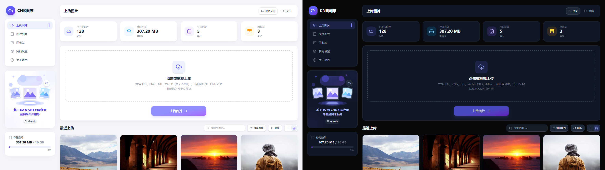

# CNB 图床

**CNB 图床**
是一个轻量级、无服务器的图片托管服务，支持图片上传（批量多选）、自动压缩与缩略图生成
该项目基于 **腾讯云 EdgeOne Pages Functions** 与 **CNB 对象存储服务**
构建，实现零成本部署与全球 CDN 加速

## 页面预览



------------------------------------------------------------------------

## 🚀 功能特性

-   📤 上传：拖拽 / 点击 / Ctrl+V 粘贴 / 整个文件夹递归上传，支持批量多选与 PicGo 客户端
-   🗜️ 压缩：浏览器端 WebP 压缩（质量与长边尺寸可调）；可选「原始」模式——不压缩、不转换，保持原始格式和大小；GIF 动图自动跳过压缩以保留动画
-   🖼️ 缩略图：自动生成缩略图链接（可关闭）
-   🈶 中文文件名完整支持；命名规则可选：**时间戳（默认，防同名覆盖）** / 保留原名 / 随机 ID
-   🔗 一键复制直链 / Markdown / HTML / BBCode（单张与批量），结果卡自带二维码
-   📋 图片列表：搜索、按文件名/大小/时间排序、类型筛选、多选批量操作、JSON 备份导出、键盘快捷键、每页条数可调（10/20/50/100）
-   🗑️ 两级删除：列表删除移入回收站（30 天内可随时恢复）；回收站「彻底删除」同步删除 CNB 原图
-   🧹 孤儿文件扫描：对比 CNB 平台资产清单与上传记录（含回收站），卡片式预览孤儿图片并可一键清理，清理后存储卡同步刷新
-   📊 存储卡实测：占用 = 仓库图片总量之和（`list-assets` 汇总），配额 = 组织存储额度（Charge 接口）；读取失败显示具体原因，点击可重试
-   🔒 访问密码保护（可选）、登录「记住我 7 天」、日间 / 夜间 / 跟随系统主题、移动端自适应

------------------------------------------------------------------------

## 🧰 技术栈

- **前端**: Vue 3 + TypeScript + Vite + TailwindCSS
- **后端**: EdgeOne Pages Node Functions + Express.js
- **上传**: Multer + CNB 对象存储服务
- **记录存储**: EdgeOne KV（全量索引 + 批量写 + 服务端分页）
- **限流**: 内存快路径 + Blob 存储共享计数（登录/上传接口跨实例生效）

## 🏗️ 架构概览

```
浏览器 (Vue 3 SPA)
  │  multipart 上传            │  REST 管理记录
  ▼                            ▼
Node Functions (/api)         EdgeOne Pages Functions (/image-records, KV 绑定)
  ├─ /upload/img  ── PUT ──► CNB 对象存储（imgslimgs 仓库）
  ├─ /upload/picgo（PicGo Basic Auth）
  ├─ /img/<path>  ◄── GET ──  CNB 源站（同源校验 + 流式代理 + 长缓存）
  └─ /auth/*（HMAC token 签发/校验，auth/status 探测密码开关）
                               │
                               ▼
                    EdgeOne KV：image_<id> 记录本体
                                + image_records_index 全量索引
```

图片直链统一走 `BASE_IMG_URL/api/img/<path>` 代理输出；上传记录由前端批量（50 条/批）
写入 KV，读取时优先命中索引 key，避免逐 key 全表扫描。

------------------------------------------------------------------------

## 📦 快速开始

### 📥 安装依赖

``` bash
pnpm install
```

### 🧑‍💻 本地开发

``` bash
pnpm dev
```

访问后打开浏览器：http://localhost:5173

### 🧪 质量检查

``` bash
pnpm lint            # ESLint
pnpm type-check      # 前端 vue-tsc
pnpm type-check:node # 后端 Node Functions tsc
pnpm test            # Vitest 单元测试（纯函数 + KV 集成逻辑）
```

------------------------------------------------------------------------

### 一键部署

[](https://console.cloud.tencent.com/edgeone/pages/new?repository-url=https%3A%2F%2Fgithub.com%2FJacky088%2FEdgeone-Imgbed%2F)（国内版）

[](https://edgeone.ai/pages/new?repository-url=https%3A%2F%2Fgithub.com%2FJacky088%2FEdgeone-Imgbed%2F)（国际版）


### 🔧 环境变量配置

在 EdgeOne 控制台中为项目添加以下变量：

    BASE_IMG_URL=你的图床域名（需以 / 结尾，例如 https://img.example.com/）
    SLUG_IMG=CNB 对象存储仓库名（格式：用户名/仓库名）
    TOKEN_IMG=CNB 仓库访问令牌（用于上传；完整功能还需下述权限，见「获取 CNB TOKEN」一节）
    SITE_PASSWORD=访问密码（可选）
    AUTH_SECRET=访问令牌签名密钥（可选，建议为随机长字符串；不设置时自动从 SITE_PASSWORD 派生。
        注意：修改 SITE_PASSWORD 或 AUTH_SECRET 会立即使所有已签发的登录令牌失效，口令泄露时可用此方式强制全端下线）
    PICGO_TOKEN=PicGo 上传接口令牌（可选，设置后启用 /api/upload/picgo 接口）
    MAX_UPLOAD_MB=单文件大小上限（可选，默认 25，最大 100）
    UPLOAD_RATE_LIMIT=上传限流（可选，次/分钟/IP，默认 120）

### KV 上传记录配置

本项目使用 KV 保存图片链接和后台列表记录：

1. 在 EdgeOne 控制台进入“存储 - KV”并开通免费账户。
2. 创建一个命名空间（例如 `cnb-imgbed-records`）。
3. 将该命名空间绑定到当前项目，变量名必须设置为 `IMG_RECORDS_KV`。
4. 重新部署项目。

删除语义（两级）：列表删除仅移入回收站（保留 30 天，可随时恢复），不删 CNB 源文件；
回收站「彻底删除」（单条/批量）会同步删除 CNB 上的原图与缩略图（官方接口 `DELETE /-/imgs/{imgPath}`，
需令牌含 `repo-manage:rw`；个别失败时仅留孤儿文件，不影响记录删除）。30 天到期自动清理仅移除记录；
由此产生的孤儿文件（仓库中存在但无记录引用）可在设置页「孤儿文件扫描」中卡片式预览并对账清理
（对比平台资产清单 `GET /-/list-assets` 与上传记录，需令牌含 `repo-manage:r`；清理前二次确认）。

### 限流共享存储（可选，推荐）

登录与上传接口的限流默认为单实例内存计数，多实例部署下阈值会被放大。部署本版本后，
Blob 存储共享计数会自动启用，使限流阈值跨实例严格生效，无需手动配置：

1. 部署项目（推送代码触发构建即可）。
2. 触发一次登录或上传请求——首次调用时平台会自动创建名为 `imgbed-rl` 的 Blob 命名空间。
3. 可在控制台「Blob 存储」页面（只读）查看 `imgbed-rl` 命名空间及 `rl` 前缀的计数键。

Blob 存储不可用时限流自动降级为单实例内存计数（尽力而为），功能不受影响。
图片直链代理 `/api/img/*` 为高频路径，始终使用单实例内存限流。

### 📷 PicGo 客户端配置（可选）

在 EdgeOne 控制台设置环境变量 `PICGO_TOKEN`（自定义一个随机长字符串）并重新部署后，
即可在 PicGo 中使用"自定义 Web 图床"插件上传：

    API 地址：https://你的域名/api/upload/picgo
    请求方式：POST
    自定义请求头：Authorization: Basic base64("api:你的PICGO_TOKEN")
    （即用户名 api，密码为 PICGO_TOKEN 的 Basic 认证）
    JSON 路径：result[0]

------------------------------------------------------------------------

## 🔑 获取 CNB TOKEN

1.  登录  [CNB官网](https://cnb.cool/)，在右上角点击头像进入个人设置
2.  选择 **访问令牌**
3.  找到你的图床仓库（需先创建且设置为公开）
4.  按下表勾选权限后生成并复制 Token，用于环境变量 `TOKEN_IMG` 配置

### 访问令牌权限清单

| 权限 | 说明 | 依赖的功能 |
| --- | --- | --- |
| `repo-code:rw` | 仓库代码读写 | 上传图片（基础必需，`upload/imgs`） |
| `repo-manage:rw` | 仓库管理读写（**包含只读能力**） | 图片总量统计与孤儿扫描（`list-assets`，最低 `:r`）；删除源文件与孤儿清理（`DELETE /-/imgs/{imgPath}`，需 `:rw`） |
| `group-resource:r` | 组织资源只读 | 存储卡用量与配额实测（`/{组织}/-/charge/*`，注意为组织级接口，服务端自动从 `SLUG_IMG` 取组织段调用） |

> `repo-manage` 的 `:r` / `:rw` 是同一权限的两档（只读 / 读写），勾选 `:rw` 即同时获得 `:r` 能力，无需重复勾选；
> 表中拆开仅表示对应功能的**最低**权限要求——若只想开启扫描/统计而不授权删除，可单独勾 `repo-manage:r`。
>
> ⚠️ 「资源范围」必须选 **全部** 或 **指定组织**（仓库在组织下时选对应组织并展开 group 区勾选 `group-resource:r`）：
> 选「指定仓库」时组织权限区不可用，`group-resource:r` 无法勾选，存储卡将显示 403。

> 仅配置上传时，`repo-code:rw` 即可；其余权限缺失时对应功能显示明确的失败提示，不影响上传与图片管理。
> 生成令牌后如修改过权限，需同步更新 EdgeOne 环境变量 `TOKEN_IMG` 并重新部署。

------------------------------------------------------------------------

## 🤝 致谢

感谢项目 [**WhY15w 的 hw‑img‑host**](https://github.com/WhY15w/hw-img-host) 提供灵感与基础实现。

------------------------------------------------------------------------


## 📄 License

本项目遵循 MIT License。

---

如果这个插件对你有帮助，欢迎在 GitHub 上点一个 ⭐ 支持作者！
